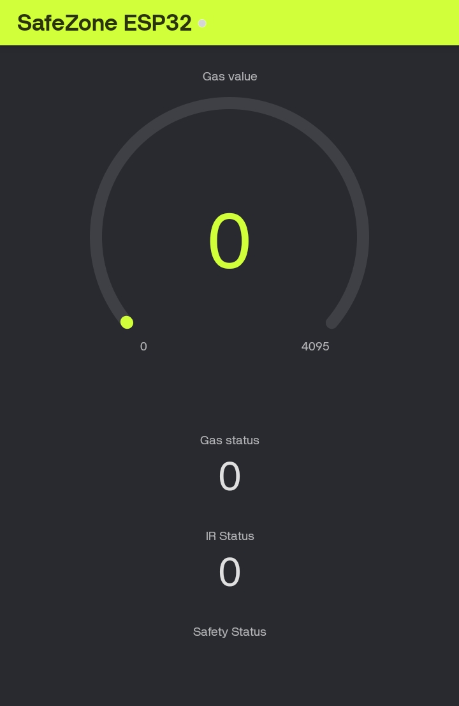

# SafeZone Guardian

## ESP32-Based Multi-Hazard Safety Monitoring and Alert System

### Problem Statement

Gas leakage and accidental entry into hazardous areas may go unnoticed, creating potential safety risks. A system is required to detect hazards early and provide an immediate warning.

### Proposed Solution

SafeZone Guardian is an ESP32-based safety monitoring system that uses an MQ-2 gas sensor to detect potentially hazardous gas conditions and an IR obstacle sensor to detect entry into a monitored restricted zone. A buzzer provides a local warning, while Blynk enables IoT-based monitoring and alerts.

## Objectives

- Detect potentially hazardous gas conditions.
- Detect entry into a restricted area.
- Provide an immediate audible warning.
- Monitor safety conditions through Blynk.

## Components Used

- ESP32 Development Board
- MQ-2 Gas Sensor
- IR Obstacle Sensor
- Buzzer Module
- 10 kΩ Resistor
- 20 kΩ Resistor
- Breadboard
- Jumper Wires
- VD-07 NCV Pen

## Pin Connections

| Component | ESP32 Pin |
|---|---|
| MQ-2 AO | GPIO 34 |
| IR OUT | GPIO 27 |
| Buzzer SIG | GPIO 26 |

MQ-2 AO is connected to GPIO34 through a 10 kΩ / 20 kΩ voltage divider.

## Working Principle

The MQ-2 monitors the surrounding air for changes associated with combustible gases or smoke. The IR sensor monitors the restricted zone. The ESP32 processes both sensor inputs.

- Normal condition → Safe status
- IR detection → Restricted-zone warning
- Gas detection → Gas alert
- Gas + IR detection → Critical alert

## Blynk IoT

The system sends data to Blynk using Virtual Pins:

- V0 → Gas Value
- V1 → Gas Status
- V2 → IR Status
- V3 → Safety Status

## Blynk Console

## Prototype

## Team

## SDG Mapping

- SDG 3 – Good Health and Well-Being
- SDG 9 – Industry, Innovation and Infrastructure
- SDG 11 – Sustainable Cities and Communities

## Key Learning

Learned how to integrate sensors with an ESP32 and IoT platform to detect hazards in real time and provide automatic safety alerts.

## Biggest Challenge

The biggest challenge was integrating and calibrating the MQ-2 gas sensor with the ESP32 while ensuring reliable sensor readings and stable Blynk communication.

## Root Cause Defined

The root cause is the lack of continuous, real-time monitoring for gas leakage and entry into hazardous areas, which can delay hazard detection and warning.

## Corrective Action Taken

We implemented an ESP32-based monitoring system using an MQ-2 gas sensor and IR sensor, added a buzzer for immediate local warnings, and connected the system to Blynk for real-time monitoring and alerts.

## Future Improvements

- Add an OLED/LCD display.
- Add additional gas sensors.
- Add automatic emergency ventilation.
- Improve sensor calibration.
- Add data logging and historical monitoring.
